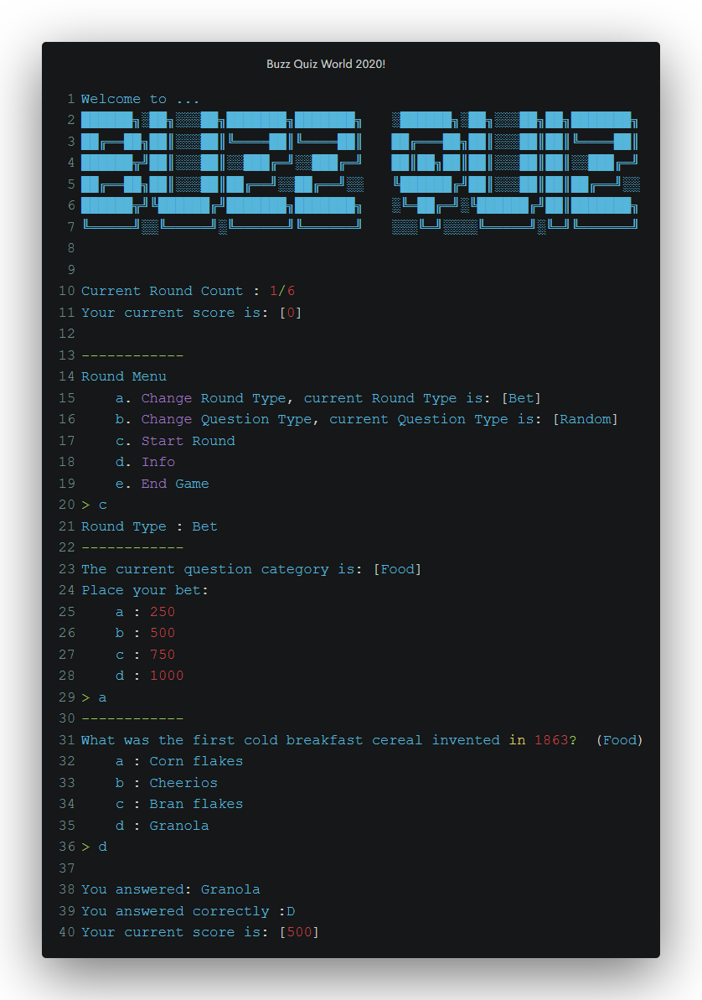

IMPORTANT NOTE:
The final release incorporates the same game with a new GUI instead of terminal. Scoreboards now exist as well as 2 players support (same keybaord). The game also supports 3 new question types as well as a dynamic question and point system. Download the game and lauch it for more info and fun!

##BUZZ 
<b>The Buzz Quiz Game<b> 

Welcome to Buzz Quiz World!
 

This is a Quiz similar to television shows.

There are 2 types of rounds. There are a lot of categories with random questions each, and 4 potential answers to accompany them
 

You can handle MENU and other options using the alphabetical keys shown in the screen before 
each option. You must press the Enter key after inserting an answer key
 

In each round you answer a set number of random questions from either a random category or a category of your selection.
 

By default, every question and round type is Random, but that can be changed before the start of every round (Round Menu)
 

If you've selected a category and the questions presented are not from the category you originally selected,
this means that there are no more questions remaining from that category and they will be presented randomly.
 

Types of Rounds:
 

1.[Right Answer], the player gets 1000 point for every right answer and loses none when answering incorrectly
 

2.[Bet], the player places a Bet of a certain amount of points from the given options,
regardless of their points. If they answer correctly he gains double the amount bet, while if they don't,
they lose points equal to their initial bet.
 

That is all. In short, answer correctly and win! Have fun!
 

