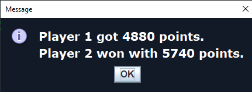
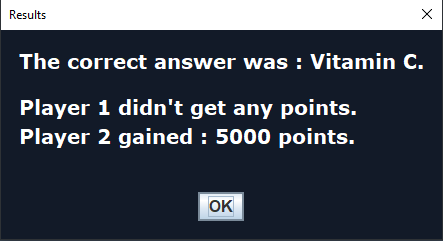

# Buzz Quiz World

An object-oriented Java application that utilizes Java Swing to portray an immersive quiz game akin to the popular game Buzz Quiz World.

Written by [@XG-PRO](https://github.com/XG-PRO) and [@konmaz](https://github.com/konmaz) in January 2021

## Installation
* Download and run the BuzzQuiz.exe file from the releases. Ensure you have the Java JDK installed.
The program also creates a scores.dat file to track leaderboards in the same directory as the .exe file.

## Features
                
1. The game works for 1 or 2 players, both utilizing the same keyboard, and selected at the start of the game.

2. Each question has a total of 4 answers, only one of which are correct. The key corresponding to each answer and to its respective player is shown besides each answer.

3. The game starts and consists of 6 random rounds. Each round has 5 questions randomly selected.
   Each player's name and total score is depicted below. 
   * If a player hasn't answered yet, their name glows White.
   * If a player has answered, and the other player has not, their name glows Grey
   * If a player has answered correctly, their name glows Green
   * If a player has answered incorrectly, their name glows Red
   
   At the end of a round, the results are announced.

When all rounds end, results are shown

4. The players can select a different category of questions or remain random.

5. The game offers a leaderboard in the form of a local scores.dat file which can be used on different computers. If a scres.dat already exists, it updates it with new results.

6. The questions are stored inside the quiz.tsv file and new questions can be added easily.

## Round Information

There are 5 types of rounds selected at random. The following is explained by selecting the Info option in-game:
 *   Right Answer gives 1000 points for a right answer and 0 to a wrong one.
 *   Bet allows you to bet points and gain double the amount if answered correctly.
     

 *   Quick Answer gives double points to the faster player to answer correctly. **Exclusive to 2 players**
 *   Stop The Counter gives as many points to the players who answer correctly as the time remaining on the counter.

<!---  -->

*   Thermometer presents questions until a player answers 5 correctly. The first one to do so gains 5000 points.  **Exclusive to 2 players.**

# Code Structure

Multiple comments and explanations have been put inside each file. A lot of different files for different jobs have been created to utilize object-oriented programming and class hierarchy efficiently

### Game.java

Starts immediately after main.java launches and contains the entire structure of the game. It builds questions, players, rounds, and the GUI frame. It then launches play() which starts the game.

It also recursively reads and present questions until all rounds are finished.

Here you can change the number of rounds in play(), as well as add new players in setNumberOfPlayers().

### GUI.java

Contains the bulk of the code in relation to the GUI. It creates every basic panel, text, color and window that is presented regardless of realtime content.

Also contains fonts, hashmaps for converting objects to Jlabels, and converts appropriate objects (like rounds, question types, timers, highscores etc.) into appropriate Jlabel objects

Below is the basic structure of the panels used in the game:

### GUI_Logic.java

Extends GUI.java

Contains the actions to show game-related logic on screen. This includes timers, questions and responses, as well as change rounds.

### GUI_Main.java

Extends GUI.java

Contains the most important popup notifications and choices while the game is played,
updates points and draws players' names and colors.

### Score.java

This class contains the score of each player on all rounds played while the game was running.
It also converts said scores to strings to be stores and displayed correctly.

It is later used in Highscores.java

### Highscores.java

It contains trees with data about player names, wins and scores. It also sorts them out and saves them on a local file (scores.dat).

At any points, it can be called to present the scores in game.

### Player.java

Represents a player. Each player has his own keyboard keys, name, points and appropriate functions for accessing said values outside class inheritance.

### Question.java

This class constructs the basic structure of each question to be used in the quiz  after gathering information from the file that was read from Game.java

It contains a name, a type and a responses array.

### QuestionImage.java

Extends Question.java to read and include an image

### Questions.java

This class handles the logic and usable functions regarding the questions of the Quiz.

It uses a hashmap to store all questions read from the .tsv file in Game.java and shuffles the questions.

It also removes the questions answered while tha game is played

It also checks if a question has an image to create it and include it respectively.

Also, it handles presenting questions either randomly or via a selected type from the players.

### Responses.java

A helper class that keeps the order in which the players have answered.
For example if "Player 2" has answered before "Player 1", he will be added first in the array and vice versa.

### Round.java

This class includes the basic structure and flow of each round regardless of type. When another class extends this one, it can add its own details and rules.

It increases and decreases points and presents the current question.

You can also change the number of questions per round here.

### RoundBet.java, RoundQuickAnswer.java, RoundRightAnswer.java, RoundStopTheTimer.java, RoundThermometer.java

All the above classes extend the Round.java class and add their unique characteristics into the round.
RoundThermometer also contains a hashmap with the amount of questions answered per player,

### Utilities.java

The final java class. It is mainly used for debugging purposes, randomization and global static methods for necessary checks.

# Regarding release 2.3.2:\
\
A scores.dat files is created in the same directory as the .exe file to keep track of scores. Old files can be transferred as well.\
This is the final release reuploaded, as old releases where negated due to forking and reuploading.\

------------------------------------------------------------
Adding additional questions can be done to the source code by simply opening the packageQuestions/quiz.tsv file and adding them manually
images can be included into packageQuestions/images and can be added to quiz.tsv by replacing the "NoImage" cell with the image's filename
IMPORTANT: If you don't add an image, include the "NoImage" besides the answer

------------------------------------------------------------
Have fun with the game!
------------------------------------------------------------
